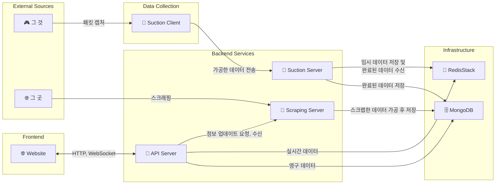

# Contributing

모기 프로젝트에 관심을 가져주셔서 감사합니다.🙏
<br>
이 페이지는 혹시나 있을 기여를 원하시는 분들을 위해 프로젝트에 대한 설명을 담았습니다.

🔥 **릴리즈 후 기여가 가능하도록 오픈하겠습니다.**

## 🚀 시작하기

Dev Container를 사용하여 개발했으며 동일한 환경을 유지하기 위해 Dev Container 사용을 권장드립니다.
<br>
Dev Container 외에 다른 가이드는 하지 않습니다.

### 1. 저장소 받기
```bash
git clone https://github.com/parkrevil/mogi.git
cd mogi
```

### 2. VSCode / Cursor에서 Dev Container 실행
1. VS Code / Cursor에서 프로젝트 폴더를 엽니다.
2. `Ctrl+Shift+P` (또는 `Cmd+Shift+P`)를 눌러 명령 팔레트를 엽니다.
3. `Dev Containers: Rebuid and Reopen in Container`를 선택합니다.
4. 컨테이너 빌드 및 설정이 자동으로 완료됩니다.
5. `🚀 Ready to start development!` 메시지가 나오면 설정이 완료 된 것입니다.

> [!NOTE]
> Dev Container는 다음을 자동으로 설정합니다:
> - Docker 환경 설정
> - Docker Container 빌드 및 실행
> - 개발 도구 설치 (Bun, Go tools 등)
>   - 프로젝트 의존성 설치

### 3. 실행
```bash
bun run dev:api
bun run dev:scraper
bun run dev:website

make dev-suction-server
make dev-suction-client
```

> [!TIP]
> 실시간 패킷을 가져오기 위해서는 suction-client는 Network Bridge 모드가 활성화된 VMWare에서 실행해야합니다.<br>
로컬 환경에서는 미리 캡처한 samples/*.pcap 파일로 개발합니다.

## 🛠️ 기술 스택

### Bun Frontend & Backend
[](https://bun.sh/)
[](https://nextjs.org/)
[](https://nestjs.com/)
[](https://socket.io/)

### Golang Ecosystem
[](https://golang.org/)
[](https://gofiber.io/)
[](https://github.com/uber-go/fx)
[](https://github.com/uber-go/zap)
[](https://github.com/google/gopacket)

### Protocols & Data
[](https://quicwg.org/)
[](https://developers.google.com/protocol-buffers)
[](https://github.com/golang/snappy)

### Infrastructure
#### Common
[](https://www.mongodb.com/)
[](https://redis.io/docs/stack/)

#### Local
[](https://www.docker.com/)

#### Production
[](https://kubernetes.io/)

## 🎯 애플리케이션

### Website
수집 정보 및 사용자 정보 제공 사이트

### API
웹사이트를 위한 Backend for Frontend (BFF) REST API 및 WebSocket 서버

### Scraper
그 곳의 정보를 수집하는 서버

### Suction Server
클라이언트에서 수집한 데이터를 받아 API Server에서 사용할 수 있도록 재가공하는 서버

### Suction Client
그 것의 패킷을 캡쳐 후 분석하고 서버로 전달하는 클라이언트

### Architecture



## 📝 라이선스

이 프로젝트는 [LICENSE](LICENSE) 기준 하에 배포됩니다. 기여하시는 코드도 동일한 라이선스를 따릅니다.
