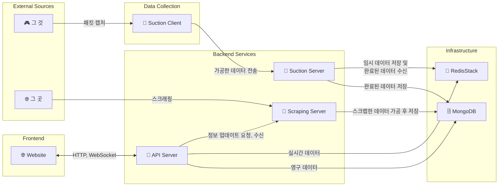

<div align="center">

<h1 style="font-size: 3em; text-decoration: none; border-bottom: none;">🦟 모기</h1>

[](https://github.com/revil/mogi)
[](https://github.com/revil/mogi)
[](https://github.com/revil/mogi)
[](https://github.com/revil/mogi)
[](LICENSE)
[](https://discord.gg/YOUR_INVITE_CODE)

</div>

## ⚠️ 꼭 읽어주세요
그것을 위한 서드파티 서비스입니다.
<br>
언제 사라질지 모르는 토이 프로젝트이며 라이센스에 맞게 이용하시면 됩니다.

문의/건의사항은 [디스코드](https://discord.gg/YOUR_INVITE_CODE)에 남겨주세요.

>서비스 이용을 위해 오신 분들은 [가이드](https://example.com/guide)를 읽고 사용하시면 됩니다.
<br>
사용 시 불이익에 대해선 아무 책임을 지지 않습니다.

⭐ **코드 및 서비스에 대한 피드백은 언제나 환영입니다.**


## 🚀 로컬 개발

### 환경 설정

```bash
# 초기 세팅
./scripts/setup.sh

# 의존성 설치
bun install
go mod tidy

# 컨테이너 시작
docker-compose up -d
```

### 실행

```bash
bun run dev:api-server
bun run dev:scraping-server
bun run dev:website

make watch-suction-server
make watch-suction-client
```

> 실시간 패킷을 가져오기 위해서는 suction-client는 Network Bridge 모드가 활성화된 VMWare에서 실행해야합니다.
로컬 환경에서는 미리 캡처한 samples/*.pcap 파일로 개발합니다.


## 🛠️ 기술 스택

### Bun Frontend & Backend
[](https://bun.sh/)
[](https://nextjs.org/)
[](https://nestjs.com/)
[](https://socket.io/)

### Golang Ecosystem
[](https://golang.org/)
[](https://gofiber.io/)
[](https://github.com/uber-go/fx)
[](https://github.com/uber-go/zap)
[](https://github.com/google/gopacket)

### Protocols & Data
[](https://quicwg.org/)
[](https://developers.google.com/protocol-buffers)
[](https://github.com/golang/snappy)

### Infrastructure
#### Common
[](https://www.mongodb.com/)
[](https://redis.io/docs/stack/)

#### Local
[](https://www.docker.com/)

#### Production
[](https://kubernetes.io/)

## 🎯 애플리케이션

### Website
수집 정보 및 사용자 정보 제공 사이트

### API Server
웹사이트를 위한 Backend for Frontend (BFF) REST API 및 WebSocket 서버

### Scraping Server
그 곳의 정보를 수집하는 서버

### Suction Server
클라이언트에서 수집한 데이터를 받아 API Server에서 사용할 수 있도록 재가공하는 서버

### Suction Client
그 것의 패킷을 캡쳐 후 분석하고 서버로 전달하는 클라이언트

### Architecture



## 🤝 같이 코딩 하실래요?

1. 레파지토리를 포크해주세요.
2. 목적에 맞는 이름으로 브랜치를 생성해주세요.(`git checkout -b {feature,bugfix,hotfix...}/amazing-feature`)
3. 작업 후 내역을 알 수 있는 메시지를 작성하여 커밋해주세요. (`git commit -m 'Add some amazing feature'`)
4. 작업 한 브랜치를 푸시한 후 (`git push origin feature/amazing-feature`)
5. PR을 생성해주세요.

## 📝 라이센스

이 프로젝트는 MIT 라이센스 하에 배포됩니다. 자세한 내용은 [LICENSE](LICENSE) 파일을 참조하세요.
